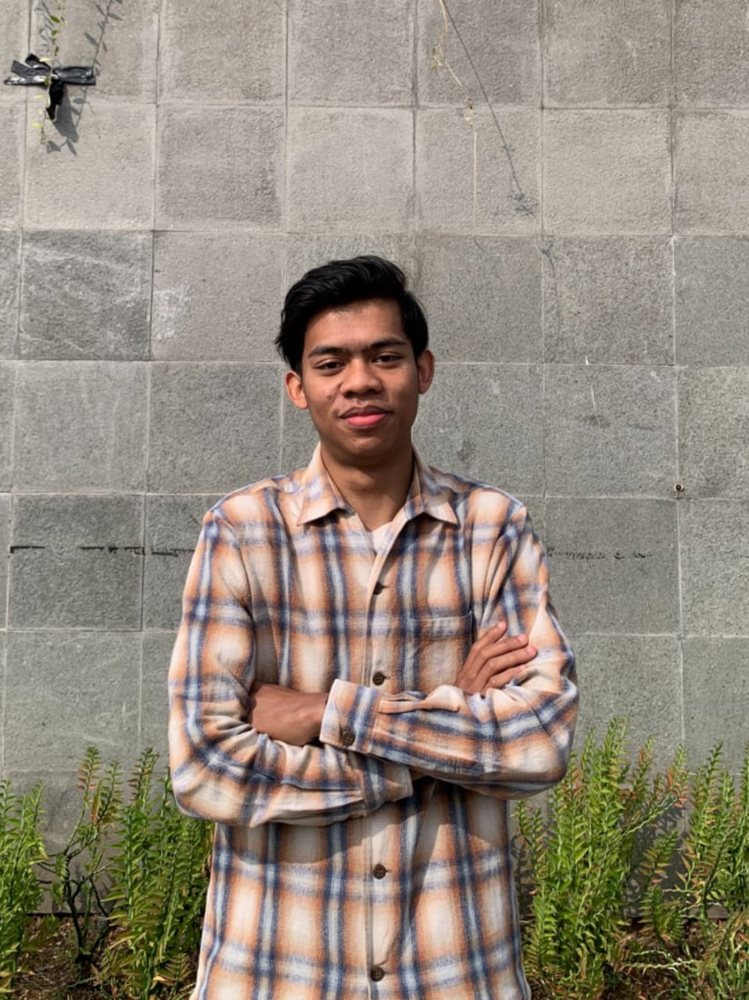

# Panduan Mengganti Foto Website KKN Girimukti 2

Panduan ini memudahkan kamu memasukkan foto-foto asli dokumentasi dan anggota kelompok kamu ke dalam website.

---

## 📁 Struktur Folder Foto

Semua aset gambar website tersimpan di dalam folder `assets/images/`:

```text
girigiri2/
└── assets/
    └── images/
        ├── hero/
        │   └── hero-bg.jpg           <-- Foto utama / banner halaman depan
        │
        ├── members/
        │   ├── member-1.jpg          <-- Ketua Tim (M. Fadhil Ar-Rayyan)
        │   ├── member-2.jpg          <-- Wakil Ketua (Amanda Putri Lestari)
        │   ├── member-3.jpg          <-- Sekretaris (Dimas Arya Pratama)
        │   ├── member-4.jpg          <-- Bendahara (Nabilla Khairunnisa)
        │   ├── member-5.jpg          <-- Div. Pendidikan & Agama (Rian Hidayatullah)
        │   ├── member-6.jpg          <-- Div. Kesehatan (dr. Siti Sarah)
        │   ├── member-7.jpg          <-- Div. Lingkungan (Ilham Maulana)
        │   ├── member-8.jpg          <-- Div. UMKM (Clarissa Maharani)
        │   ├── member-9.jpg          <-- Div. Pubdok (Bagas Dwi Pamungkas)
        │   └── member-10.jpg         <-- Div. Logistik & Humas (Fathur Rahman)
        │
        ├── proker/
        │   ├── proker-1.jpg          <-- 01. Edukasi Bullying Anak SD
        │   ├── proker-2.jpg          <-- 02. Pengajian TPA Al-Ikhlas
        │   ├── proker-3.jpg          <-- 03. Seminar Edukasi Stunting
        │   ├── proker-4.jpg          <-- 04. Edukasi Sampah Anak SD
        │   ├── proker-5.jpg          <-- 05. Seminar UMKM
        │   └── proker-6.jpg          <-- 06. Inisiatif Sosial & Kreatif
        │
        └── gallery/
            ├── gallery-1.jpg s/d gallery-20.jpg <-- 20 Foto Dokumentasi & Kilas Balik
```

---

## 🚀 Cara Mengganti Foto

### 🔹 Cara 1 (Paling Cepat & Mudah — Tanpa Edit Kode)
1. Siapkan foto-foto kamu di komputer.
2. Ganti nama file foto kamu agar sama persis dengan nama file di atas (misal: `member-1.jpg`, `proker-1.jpg`, dst).
3. **Copy & Paste (Replace/Timpa)** file tersebut ke dalam folder yang bersangkutan (`assets/images/members/`, `assets/images/proker/`, dst).
4. Buka website di browser lalu tekan `Ctrl + F5` (Hard Reload). Semua foto kamu langsung tampil otomatis!

---

### 🔹 Cara 2 (Jika Ingin Menggunakan Nama File Asli / Format .PNG, .WebP)
1. Taruh foto kamu ke dalam folder yang sesuai (misal `assets/images/members/adam.jpg`).
2. Buka file `index.html` menggunakan editor teks (VS Code / Antigravity).
3. Cari nama anggota atau bagian yang ingin diubah, lalu ubah atribut `src`:
   ```html
   <!-- Contoh sebelum: -->
   

   <!-- Contoh sesudah: -->
   
   ```
4. Simpan file `index.html` dan refresh browser.

---

## 💡 Tips Agar Tampilan Foto Maksimal
- **Foto Anggota**: Gunakan foto formal/semi-formal vertikal (rasio 4:5 atau 3:4). Website sudah diatur dengan `object-fit: cover` sehingga foto tidak akan gepeng atau terdistorsi.
- **Foto Hero & Proker**: Gunakan foto horizontal / landscape (rasio 16:9 atau 4:3).
- **Ukuran File**: Agar web tetap cepat dimuat, usahakan ukuran per foto sekitar 200 KB – 1.5 MB.
- **Mengganti Nama & Gelar Anggota**: Jika nama/gelar anggota di tim kamu berbeda, kamu cukup mengubah teks di dalam tag `<h3>` dan `<p class="member-role">` pada file `index.html`.
- **Pengaturan Ukuran Kolase Galeri (Besar / Lebar / Tinggi / Standar)**:
  Pada file `index.html` di bagian galeri, kamu bisa mengatur ukuran tiap foto dengan mengganti class berikut:
  - `gallery-item--featured` : Foto Utama Besar (2x2 kotak, sangat menonjol)
  - `gallery-item--wide` : Foto Melebar Horizontal (2x1 kotak, cocok untuk foto lanskap/panorama)
  - `gallery-item--tall` : Foto Tinggi Vertikal (1x2 kotak, cocok untuk foto potret berdiri)
  - `gallery-item--standard` : Foto Kotak Standar (1x1 kotak)
  - Layout otomatis menyesuaikan di perangkat Desktop maupun HP (Mobile) tanpa merusak kerapihan tampilan!

